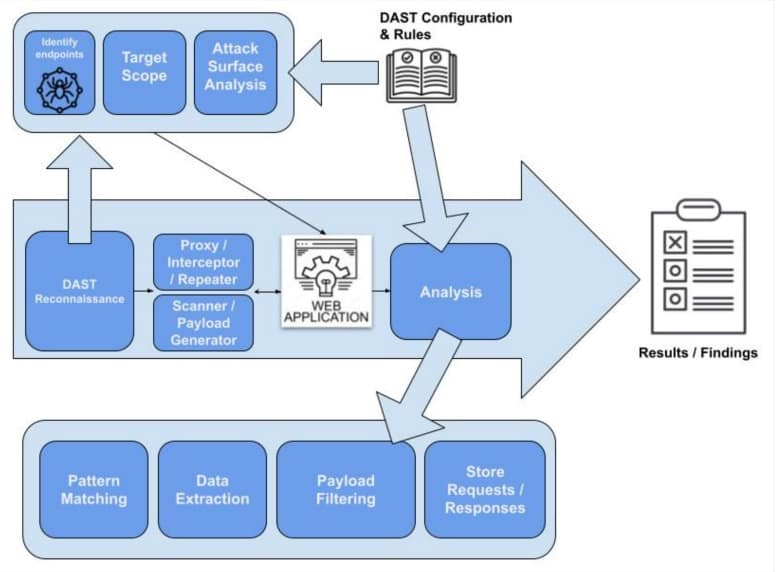
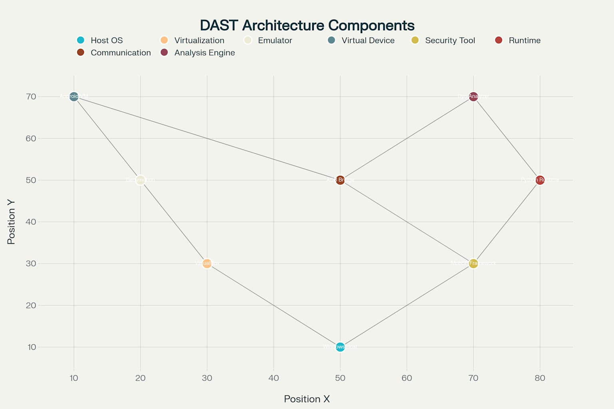
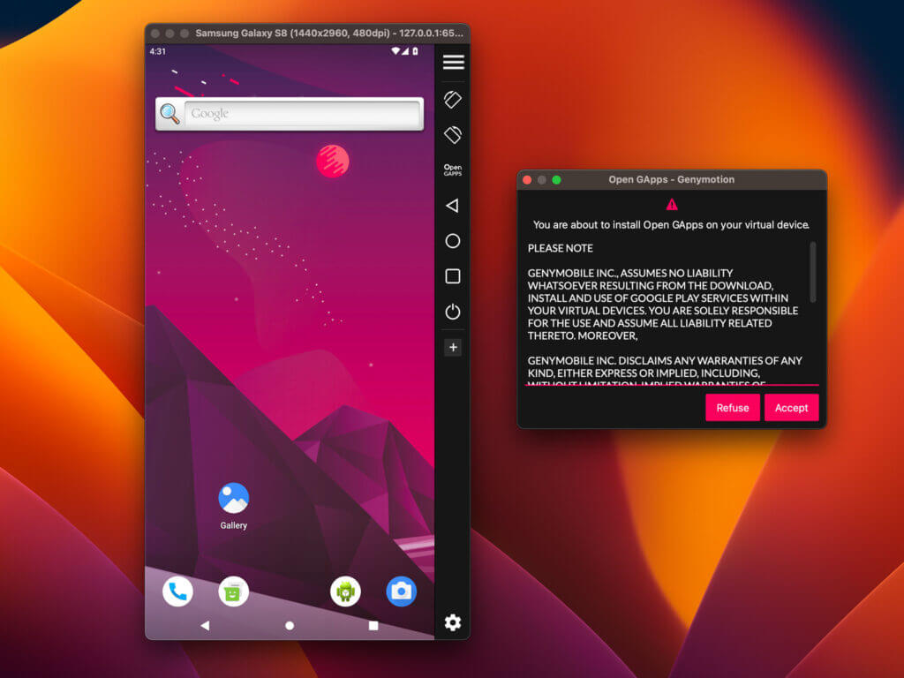
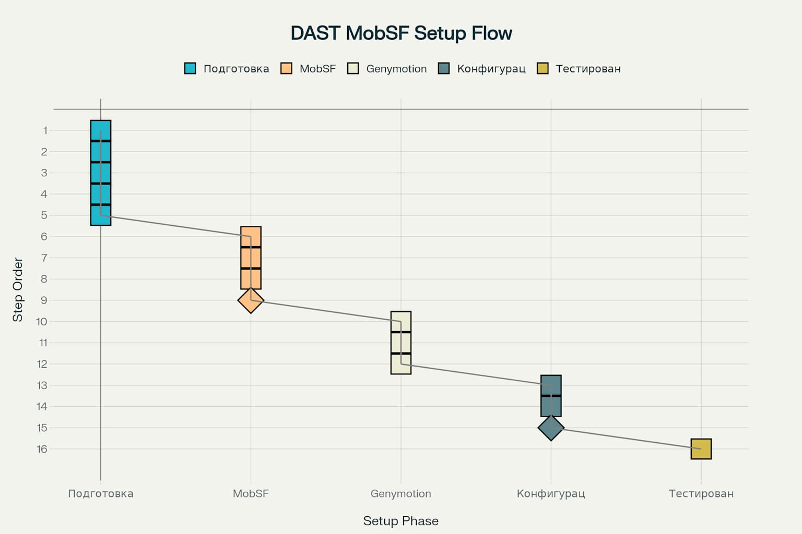

# Настройка DAST с Genymotion на Windows для MobSF

Динамический анализ безопасности приложений (DAST) с использованием Mobile Security Framework (MobSF) и эмулятора Genymotion представляет собой мощный инструментарий для тестирования безопасности мобильных приложений Android. Данное руководство содержит пошаговые инструкции по настройке этой конфигурации на операционной системе Windows.



A flow diagram illustrating the typical process and architectural components of a Dynamic Application Security Testing (DAST) framework.

## Обзор архитектуры системы

MobSF представляет собой автоматизированный фреймворк для анализа безопасности мобильных приложений, поддерживающий как статический, так и динамический анализ. Для динамического анализа Android-приложений MobSF использует Android Debug Bridge (ADB) для взаимодействия с эмулятором или физическим устройством[^1][^2].



Архитектура настройки DAST с MobSF и Genymotion

Genymotion является одним из наиболее эффективных Android-эмуляторов для тестирования безопасности, поскольку он базируется на VirtualBox и предоставляет root-доступ по умолчанию, что критично для глубокого анализа безопасности[^3][^4].

## Системные требования

Перед началом установки необходимо убедиться, что система соответствует минимальным требованиям для корректной работы всех компонентов.

**Важно**: MobSF поддерживает динамический анализ только для Android API уровня до 28 включительно. Более новые версии Android имеют ограничения на запись в директорию /system, что делает невозможным установку необходимых агентов MobSF[^5][^6].

## Этап 1: Подготовка системы Windows

### Установка Python

1. **Скачайте Python версии 3.8-3.11** с официального сайта python.org
2. **Запустите установщик с правами администратора**
3. **Обязательно отметьте опцию "Add Python to PATH"**
4. **Проверьте установку**: откройте командную строку и выполните `python --version`

### Установка JDK

1. **Скачайте Oracle JDK 8 или новее** или используйте OpenJDK
2. **Установите JDK**, следуя инструкциям установщика
3. **Настройте переменную окружения JAVA_HOME**:
    - Перейдите в Панель управления → Система → Дополнительные параметры системы
    - Нажмите "Переменные среды"
    - Добавьте новую системную переменную JAVA_HOME со значением пути к JDK

### Установка Git

1. **Скачайте Git для Windows** с git-scm.com
2. **Запустите установку** с настройками по умолчанию
3. **Проверьте установку**: `git --version`

### Установка Microsoft Visual C++ Build Tools

1. **Скачайте Visual Studio Build Tools** или Visual Studio Community
2. **Выберите компоненты C++ build tools** во время установки
3. **Перезагрузите систему** после установки

### Установка OpenSSL

1. **Скачайте OpenSSL для Windows** (64-bit версию) с slproweb.com
2. **Установите в стандартную директорию**
3. **Добавьте путь к OpenSSL в переменную PATH**

## Этап 2: Установка и настройка MobSF

### Клонирование репозитория

Откройте командную строку как администратор и выполните:

```bash
git clone https://github.com/MobSF/Mobile-Security-Framework-MobSF.git
cd Mobile-Security-Framework-MobSF
```


### Запуск установки

Выполните автоматический скрипт установки:

```bash
setup.bat
```

Этот процесс может занять 10-20 минут, так как происходит загрузка всех необходимых зависимостей[^7].

### Первый запуск MobSF

После успешной установки запустите MobSF:

```bash
run.bat 127.0.0.1:8000
```

Откройте браузер и перейдите по адресу `http://127.0.0.1:8000`. Должен открыться веб-интерфейс MobSF с логином и паролем `mobsf/mobsf`[^8][^9].

## Этап 3: Установка Genymotion и VirtualBox

### Установка VirtualBox

1. **Скачайте VirtualBox** с официального сайта Oracle
2. **Запустите установку** с правами администратора
3. **Следуйте инструкциям установщика** и примите временное отключение сети

### Установка Genymotion

1. **Зарегистрируйтесь** на сайте genymotion.com для получения персональной лицензии
2. **Скачайте Genymotion Desktop** (включая VirtualBox или без него, если уже установлен)
3. **Запустите установку** и следуйте инструкциям
4. **Войдите в учетную запись** при первом запуске Genymotion



Genymotion Android emulator interface showing a Samsung Galaxy S8 virtual device and an Open GApps installation prompt.

### Создание виртуального устройства

1. **Запустите Genymotion** и нажмите кнопку "+" для добавления нового устройства
2. **Выберите Android-устройство** с API 28 или ниже (рекомендуется Android 9, API 28)
3. **Настройте параметры устройства**: объем RAM, разрешение экрана
4. **Дождитесь загрузки** образа системы (может занять значительное время)
5. **Запустите созданное устройство** для проверки работоспособности

## Этап 4: Настройка ADB и подключения

### Установка Android SDK Platform Tools

1. **Скачайте Android SDK Platform Tools** с developer.android.com
2. **Извлеките архив** в удобную директорию (например, `C:\platform-tools`)
3. **Добавьте путь к platform-tools в переменную PATH**

### Настройка ADB в Genymotion

1. **Откройте настройки Genymotion** (Settings)
2. **Перейдите в раздел ADB**
3. **Выберите "Use custom Android SDK tools"**
4. **Укажите путь к Android SDK** (директория, содержащая platform-tools)

### Проверка подключения ADB

1. **Запустите виртуальное устройство** в Genymotion
2. **Запомните IP-адрес** устройства (отображается в заголовке окна эмулятора)
3. **Откройте командную строку** и выполните:
```bash
adb connect IP_ADDRESS:5555
adb devices
```

Вы должны увидеть подключенное устройство в списке[^2][^10].

## Этап 5: Конфигурация MobSF для динамического анализа

### Настройка ANALYZER_IDENTIFIER

Если MobSF не может автоматически обнаружить Android-устройство, необходимо настроить идентификатор вручную:

1. **Найдите файл конфигурации** в `<пользователь>/.MobSF/config.py`
2. **Добавьте или измените строку**:
```python
ANALYZER_IDENTIFIER = 'IP_ADDRESS:5555'
```

где IP_ADDRESS - это адрес вашего Genymotion устройства[^2][^11].

### Настройка ADB_BINARY (при необходимости)

Если MobSF не может найти ADB, добавьте в config.py:

```python
ADB_BINARY = 'C:\\platform-tools\\adb.exe'
```


### Включение отладки USB на виртуальном устройстве

1. **На эмуляторе Android** перейдите в Настройки → О телефоне
2. **Нажмите 7 раз на номер сборки** для активации режима разработчика
3. **Вернитесь в Настройки** → Параметры разработчика
4. **Включите "Отладку по USB"**

## Этап 6: Запуск и тестирование динамического анализа



Пошаговый процесс настройки DAST с MobSF и Genymotion

### Подготовка к тестированию

1. **Убедитесь, что Genymotion устройство запущено** и подключено через ADB
2. **Запустите MobSF** командой `run.bat 127.0.0.1:8000`
3. **Откройте веб-интерфейс** MobSF в браузере

### Загрузка и анализ APK

1. **Загрузите APK-файл** для анализа через веб-интерфейс MobSF
2. **Дождитесь завершения статического анализа**
3. **Перейдите к разделу "Dynamic Analysis"** в боковом меню
4. **Нажмите "Start Dynamic Analysis"**

### Процесс динамического анализа

1. **MobSF автоматически установит** необходимые агенты на виртуальное устройство
2. **Приложение будет установлено** и запущено на эмуляторе
3. **Взаимодействуйте с приложением** для генерации трафика и активности
4. **MobSF будет перехватывать** сетевой трафик и анализировать поведение приложения

## Устранение распространенных проблем

### Ошибка "Android Runtime not found"

**Причина**: MobSF не может обнаружить Android-устройство[^12].

**Решение**:

1. Проверьте, что устройство видимо через `adb devices`
2. Настройте ANALYZER_IDENTIFIER в config.py
3. Перезапустите MobSF

### Ошибка "VM's /system is not writable"

**Причина**: Используется Android API выше 28 или устройство не имеет root-доступа[^5].

**Решение**:

1. Используйте Android 9 (API 28) или ниже
2. Убедитесь, что эмулятор имеет root-доступ
3. Для Android Studio эмулятора добавьте флаг `-writable-system`

### Проблемы с подключением ADB

**Причина**: Конфликт между различными ADB серверами[^13].

**Решение**:

1. Остановите все ADB процессы: `adb kill-server`
2. Перезапустите ADB: `adb start-server`
3. Переподключите устройство: `adb connect IP:5555`

### Ошибки установки зависимостей

**Причина**: Отсутствие необходимых компиляторов или библиотек[^14].

**Решение**:

1. Установите Microsoft Visual C++ Build Tools
2. Обновите pip: `python -m pip install --upgrade pip`
3. Установите зависимости по одной для выявления проблемных пакетов

## Рекомендации по безопасности

### Сетевая безопасность

1. **Ограничьте доступ к порту 5555** только с локальной машины
2. **Не открывайте ADB порт** для внешних подключений
3. **Используйте файервол** для контроля сетевого трафика

### Изоляция среды тестирования

1. **Используйте выделенную сеть** для тестирования
2. **Изолируйте тестовое окружение** от производственных систем
3. **Регулярно обновляйте** все компоненты системы

## Заключение

Настройка DAST с MobSF и Genymotion на Windows требует тщательной подготовки и соблюдения всех этапов установки. Правильно настроенная система позволяет проводить глубокий анализ безопасности Android-приложений, включая перехват сетевого трафика, анализ API-вызовов и выявление уязвимостей во время выполнения.

Ключевые моменты для успешной настройки:

- Использование Android API 28 или ниже для совместимости с MobSF
- Правильная конфигурация ADB и сетевых подключений
- Внимательное следование системным требованиям
- Тестирование каждого этапа настройки перед переходом к следующему

При возникновении проблем рекомендуется обращаться к официальной документации MobSF и сообществу разработчиков для получения поддержки.

<div style="text-align: center">⁂</div>

[^1]: https://null-android-pentesting.netlify.app/src/dynamic-analysis/using-mobsf.html

[^2]: https://infosecwriteups.com/mobsf-simplifying-mobile-app-security-testing-b3103739eb76

[^3]: https://stackoverflow.com/questions/62729921/how-to-run-dynamic-analysis-by-mobsf

[^4]: https://www.browserstack.com/guide/android-emulators-for-windows

[^5]: https://www.youtube.com/watch?v=wZqIpnwC62Q

[^6]: https://pt.slideshare.net/slideshow/appsec-pnw-android-and-ios-application-security-with-mobsf/269727387

[^7]: https://stackoverflow.com/questions/78982102/failure-to-connect-mobsf-container-to-genymotion-vm-via-adb

[^8]: https://www.youtube.com/watch?v=QzsNn3GhYYk

[^9]: https://www.genymotion.com/blog/tutorial/mobsf-genymotion-device-image/

[^10]: https://www.slideshare.net/slideshow/mobsf-mobile-security-testing-androidios/262458671

[^11]: https://www.freebuf.com/articles/mobile/368008.html

[^12]: https://developer.android.com/studio/run/emulator/

[^13]: https://mobsf.github.io/docs/

[^14]: https://www.youtube.com/watch?v=0ar8uD07Sy0

[^15]: https://www.youtube.com/watch?v=XiPLW-TsuyU

[^16]: https://developer.android.com/studio/run/emulator-commandline

[^17]: https://www.youtube.com/watch?v=4nzt1uwuwf8

[^18]: https://github.com/MobSF/Mobile-Security-Framework-MobSF?tab=readme-ov-file

[^19]: https://github.com/MobSF/Mobile-Security-Framework-MobSF/issues/2376

[^20]: https://source.android.com/docs/setup/test/avd

[^21]: https://dev.to/blue_byte/installing-genymotion-for-android-app-pentesting-the-definitive-guide-repost-of-my-old-article-m32

[^22]: https://www.packtpub.com/en-us/product/android-security-cookbook-9781782167167/chapter/1-android-development-tools-1/section/using-the-android-debug-bridge-adb-to-interact-with-the-avds-ch01lvl1sec10

[^23]: https://github.com/MobSF/Mobile-Security-Framework-MobSF/issues/1407

[^24]: https://samsclass.info/128/proj/M305.htm

[^25]: https://javanexus.com/blog/boost-app-testing-genymotion-android-studio

[^26]: https://emteria.com/blog/adb-android

[^27]: https://github.com/MobSF/Mobile-Security-Framework-MobSF

[^28]: https://app.daily.dev/posts/installing-genymotion-for-android-app-pentesting-a-step-by-step-guide-zzufzttep

[^29]: https://wiki.laptop.org/go/Android/Adb

[^30]: https://unix.stackexchange.com/questions/687539/mobsf-installation-error-error-while-creating-virtual-environment

[^31]: https://www.youtube.com/watch?v=Dv-OU_n9dbs

[^32]: https://www.geeksforgeeks.org/genymotion-emulator-for-android-studio/

[^33]: https://www.guru99.com/adb-connect.html

[^34]: https://github.com/MobSF/Mobile-Security-Framework-MobSF/issues/322

[^35]: https://www.infosecinstitute.com/resources/penetration-testing/android-penetration-tools-walkthrough-series-mobsf/

[^36]: https://www.skillsoft.com/course/testing-android-apps-fe1bd639-e4cb-11e6-8282-0242c0a80a04

[^37]: https://www.repeato.app/how-to-enable-adb-access-for-genymotion-android-emulator/

[^38]: https://github.com/MobSF/Mobile-Security-Framework-MobSF/issues/292

[^39]: https://wiki.elvis.science/index.php?title=Install_Mobile-Security-Framework-MobSF

[^40]: https://www.youtube.com/watch?v=8Ldu_pc4m54

[^41]: https://stackoverflow.com/questions/78083733/error-running-adb-command-while-running-mobsf-dynamic-analysis

[^42]: https://developer-docs.magicleap.cloud/docs/guides/developer-tools/android-debug-bridge/adb-setup/

[^43]: https://www.youtube.com/watch?v=ekchGSOJonY

[^44]: https://github.com/MobSF/Mobile-Security-Framework-MobSF/issues/2266

[^45]: https://www.xda-developers.com/install-adb-windows-macos-linux/

[^46]: https://superuser.com/questions/1081919/use-adb-with-genymotion-from-concurrent-linux-vm

[^47]: https://github.com/MobSF/Mobile-Security-Framework-MobSF/issues/123

[^48]: https://www.herongyang.com/Android/adb-Install-SDK-Platform-Tools.html

[^49]: https://github.com/MobSF/Mobile-Security-Framework-MobSF/issues/1343

[^50]: https://sarpex.com/2016/10/connect-genymotion-emulator-remotely/

[^51]: https://help.esper.io/hc/en-us/articles/12657625935761-Installing-the-Android-Debug-Bridge-ADB-Tool

[^52]: https://pkg.go.dev/gitlab.com/gitlab-org/security-products/analyzers/mobsf/v2

[^53]: https://stackoverflow.com/questions/17530181/genymotion-android-emulator-adb-access

[^54]: https://www.youtube.com/watch?v=g___gGA9jn8

[^55]: https://xpertstec.com/technology/how-to-install-genymotion-emulator-on-windows/

[^56]: https://github.com/MobSF/Mobile-Security-Framework-MobSF/issues/2121

[^57]: https://andrewwegner.com/install-mobsf-on-windows-docker.html

[^58]: https://www.youtube.com/watch?v=rDPIvAiAezo

[^59]: https://mobsf.live/api_docs

[^60]: https://wiki.crestsolution.com/hemant.prasad/Mobile-Security-Framework-MobSF/-/tree/c660ca099baf4f7a8d334a5a0922c3c0d56416e3/mobsf/install/windows

[^61]: https://www.youtube.com/watch?v=16YFJeIZ4G8

[^62]: https://github.com/MobSF/Mobile-Security-Framework-MobSF/issues/1137

[^63]: https://mobsf.github.io/Mobile-Security-Framework-MobSF/

[^64]: https://www.youtube.com/watch?v=wTBu4K4Qu-w

[^65]: https://android-pentesting-at-appsecco.netlify.app/src/dynamic-analysis/using-mobsf.html

[^66]: https://github.com/MobSF/Mobile-Security-Framework-MobSF/issues/1502

[^67]: https://blog.csdn.net/xiangxiao1842/article/details/120534084

[^68]: https://github.com/MobSF/Mobile-Security-Framework-MobSF/releases

[^69]: https://ppl-ai-code-interpreter-files.s3.amazonaws.com/web/direct-files/0df4429f53fbc6aeedcf69d461a51907/c8856910-d89a-485e-b938-db8da7834baa/2721b4f5.csv

